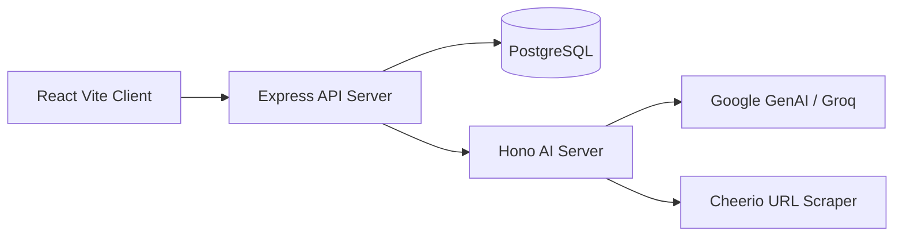

# Neptune

[](https://turbo.build/)
[](https://bun.sh/)
[](https://vite.dev/)
[](https://expressjs.com/)
[](https://www.postgresql.org/)
[](https://www.typescriptlang.org/)

Neptune is an AI-powered bookmark and knowledge management platform. It helps users save useful web content, automatically generate bookmark metadata from URLs, organize links with categories and tags, search saved knowledge semantically, chat with saved content, and share public content/profile links.

## Live Demo

https://neptune-frontend-beta.vercel.app/

## Table of Contents

- [Features](#features)
- [Architecture](#architecture)
- [Tech Stack](#tech-stack)
- [Repository Structure](#repository-structure)
- [Getting Started](#getting-started)
- [Environment Variables](#environment-variables)
- [Database](#database)
- [Docker](#docker)
- [Scripts](#scripts)
- [Documentation](#documentation)
- [Testing](#testing)
- [Contributing](#contributing)

## Features

- User signup, signin, signout, password update, and account deletion.
- Protected dashboard for managing saved content.
- Bookmark create, read, update, delete, category, tag, and share workflows.
- Magic Fill URL processing to generate title, description, category, and tags.
- AI chat flow for asking questions about saved knowledge.
- Public share links for individual content and user profiles.
- Shared Zod validation schemas across workspaces.
- PostgreSQL database schema and Drizzle migration files.
- Dockerfiles and GitHub Actions workflows for deployment pipelines.

## Architecture



The project is split into independent workspaces:

- `apps/web/client`: React frontend.
- `apps/web/server`: Express backend API.
- `apps/aiServer`: Hono AI microservice.
- `packages/*`: shared UI, icons, validation, TypeScript config, ESLint config, and utility libraries.

## Tech Stack

| Area | Tools |
| --- | --- |
| Frontend | React, Vite, TypeScript, Tailwind CSS, Redux Toolkit, TanStack Query |
| Backend API | Bun, Express, Drizzle ORM, Zod, JWT, Cookie Parser |
| AI Service | Bun, Hono, LangChain, Cheerio, Google GenAI, Groq |
| Database | PostgreSQL, Drizzle migrations |
| Monorepo | Turborepo, Bun workspaces |
| DevOps | Docker, GitHub Actions, Vercel config |

## Repository Structure

```text
.
├── .github/workflows
│   ├── ai-server.yml
│   ├── client.yml
│   └── server.yml
├── apps
│   ├── aiServer
│   └── web
│       ├── client
│       └── server
├── docker
│   ├── dockerfile.ai-server
│   ├── dockerfile.client
│   └── dockerfile.server
├── packages
│   ├── eslint-config
│   ├── icons
│   ├── libs
│   ├── typescript-config
│   ├── ui
│   └── validator
├── CONTRIBUTING.md
├── INSTALLATION_AND_EXECUTION.md
├── TEST_CASES_AND_RESULTS.md
├── package.json
├── turbo.json
└── README.md
```

## Getting Started

Install dependencies:

```bash
bun install
```

Run all development services:

```bash
bun run dev
```

Default local URLs:

| Service | URL |
| --- | --- |
| Frontend | `http://localhost:5173` |
| Backend API | `http://localhost:3000` |
| AI Server | `http://localhost:3002` |

For complete local setup, see [INSTALLATION_AND_EXECUTION.md](./INSTALLATION_AND_EXECUTION.md).

## Environment Variables

The project uses separate `.env` files for each app:

```text
apps/web/client/.env
apps/web/server/.env
apps/aiServer/.env
```

Environment examples and explanations are available in [INSTALLATION_AND_EXECUTION.md](./INSTALLATION_AND_EXECUTION.md).

## Database

Database schema, migrations, and Drizzle configuration are included in:

```text
apps/web/server/src/drizzle/schema.ts
apps/web/server/src/drizzle/migrations/
apps/web/server/src/drizzle/drizzle.config/drizzle.config.ts
```

Run migrations:

```bash
cd apps/web/server
bun run migratee
```

## Docker

Dockerfiles are available for all runtime services:

```text
docker/dockerfile.client
docker/dockerfile.server
docker/dockerfile.ai-server
```

Build images from the repository root:

```bash
docker build -f docker/dockerfile.client -t neptune-client .
docker build -f docker/dockerfile.server -t neptune-server .
docker build -f docker/dockerfile.ai-server -t neptune-ai-server .
```

Run commands and environment examples are documented in [INSTALLATION_AND_EXECUTION.md](./INSTALLATION_AND_EXECUTION.md).

## Scripts

Root scripts:

| Command | Description |
| --- | --- |
| `bun run dev` | Run all workspace development servers through Turborepo |
| `bun run build` | Build all configured workspaces |
| `bun run lint` | Run lint checks |
| `bun run check-types` | Run TypeScript checks |
| `bun run format` | Format TypeScript, TSX, and Markdown files |

Backend database scripts:

| Command | Location | Description |
| --- | --- | --- |
| `bun run generatee` | `apps/web/server` | Generate Drizzle migration files |
| `bun run migratee` | `apps/web/server` | Apply Drizzle migrations |

## Documentation

- [Installation and Execution Steps](./INSTALLATION_AND_EXECUTION.md)
- [Contribution Steps](./CONTRIBUTING.md)
- [Test Cases and Results](./TEST_CASES_AND_RESULTS.md)

Project report and user manual files are intentionally excluded from this repository submission.

## Testing

Current verification is based on:

```bash
bun run check-types
bun run lint
bun run build
```

Manual functional test cases are listed in [TEST_CASES_AND_RESULTS.md](./TEST_CASES_AND_RESULTS.md).

## Contributing

Please read [CONTRIBUTING.md](./CONTRIBUTING.md) before making changes.

## License

This repository does not currently include a license file. Add one before distributing or accepting external open-source contributions.
